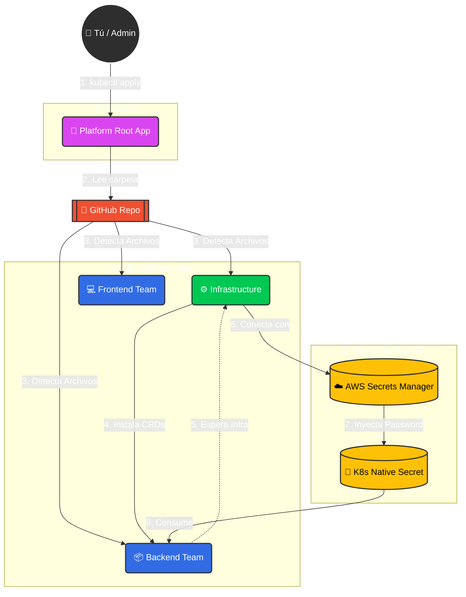

# ☸️ AWS EKS Enterprise Platform Engineering


## 📖 Descripción del Proyecto

Este repositorio contiene una implementación de referencia ("Golden Path") para una **Plataforma de Ingeniería de Grado Enterprise**.

El objetivo no es simplemente desplegar un clúster de Kubernetes, sino construir un **Ecosistema de Plataforma** completo, seguro y escalable que permita a los equipos de desarrollo desplegar software sin fricción, siguiendo las mejores prácticas de la industria: **GitOps**, **SecretOps** e **Infraestructura como Código (IaC)**.

### 🎯 Objetivos de Arquitectura
1.  **Inmutabilidad:** Toda la infraestructura se define en código (Terraform). Nada se hace "a mano" en la consola.
2.  **GitOps Puro:** El estado del clúster se sincroniza automáticamente desde Git usando ArgoCD. No más `kubectl apply` manuales.
3.  **Seguridad Bancaria:** Cero secretos en texto plano. Integración nativa con **AWS Secrets Manager** mediante External Secrets Operator.
4.  **Escalabilidad Dinámica:** Uso del patrón **App of Apps** que permite el Onboarding/Offboarding de equipos (Tenants) simplemente agregando o borrando archivos en Git.
5.  **FinOps & Disciplina:** Protocolos automatizados de destrucción y auditoría forense para garantizar costos cero cuando no está en uso.

---

## 🧩 Arquitectura GitOps: Patrón "App of Apps"

Este proyecto utiliza un diseño jerárquico donde una **Aplicación Madre (Root)** gestiona el ciclo de vida de todas las demás aplicaciones (Tenants). Esto permite desplegar la plataforma entera con un solo comando `kubectl apply`.



**Explicación del Flujo de Trabajo:**
1.  **Bootstrapping:** El administrador despliega manualmente solo la `Platform Root App` (El Jefe).
2.  **Auto-Discovery:** La Root App vigila la carpeta `gitops/tenants/` en el repositorio Git.
3.  **Expansión:** ArgoCD detecta los manifiestos de los equipos (Backend, Frontend, Infra) y despliega sus aplicaciones automáticamente.
4.  **Gestión de Dependencias:** La aplicación de Infraestructura instala el *External Secrets Operator* antes que el resto.
5.  **Inyección de Secretos:** Una vez activo, el operador se conecta a AWS, descarga las credenciales de forma segura y las convierte en secretos nativos de Kubernetes (K8s Secret) para que el Backend las consuma sin fricción.

---

## 🏗️ Arquitectura de la Solución

La plataforma se divide en capas lógicas de responsabilidad:

### Capa 0: Infraestructura (AWS + Terraform/Terragrunt)
* **Red (VPC):** Diseño de 3 capas (Pública/Privada/Data) en Multi-AZ para alta disponibilidad.
* **Compute (EKS):** Clúster Kubernetes v1.29+ con Nodos Gestionados (Managed Node Groups) optimizados.
* **IAM:** Roles granulares con políticas de mínimo privilegio (IRSA).

### Capa 1: Plano de Control (ArgoCD)
* Motor de GitOps desplegado vía Terraform (Helm Provider).
* Gestión automatizada del ciclo de vida de las aplicaciones.
* Self-Healing: Si alguien borra un recurso manualmente, ArgoCD lo restaura al instante.

### Capa 2: Seguridad & Secretos (External Secrets Operator)
* **Source of Truth:** AWS Secrets Manager.
* **Sincronización:** El operador inyecta credenciales en tiempo real dentro de los Pods.
* **Rotación:** Permite rotar passwords en AWS sin redeployar las aplicaciones.

### Capa 3: Aplicaciones (Tenants)
Ejemplos de cargas de trabajo reales desplegadas:
* **Backend:** Go application con Redis.
* **Frontend:** Microservicio expuesto vía Load Balancer.

---

## 📂 Estructura del Repositorio

El proyecto sigue una estructura modular estricta para separar responsabilidades:

```text
.
├── gitops/                  # 🧠 El "Cerebro" de ArgoCD
│   ├── control-plane/       # Root App (Patrón App of Apps)
│   └── tenants/             # Definición de Microservicios (Backend, Frontend, Infra)
│
├── iac/                     # 🧱 Infraestructura como Código
│   ├── live/dev/            # Entorno de Desarrollo (Instanciación)
│   │   ├── vpc/             # Red
│   │   ├── eks/             # Clúster
│   │   └── platform/        # ArgoCD Base Installation
│   └── modules/             # Módulos reutilizables de Terraform
│
└── scripts/                 # 🛡️ Suite de Automatización y FinOps
    ├── setup_backend.sh     # Inicio del Lab (S3 + DynamoDB)
    ├── nuke_loadbalancers.sh# Limpieza de recursos huérfanos
    ├── nuke_vpc.sh          # Eliminación de dependencias de red
    └── deep_sweep_finops.sh # Auditoría Forense de Costos (Nivel Experto)
```

---

## 🚀 Inicio Rápido (Quickstart)

Para desplegar este laboratorio desde cero, sigue estrictamente el Runbook Maestro.

👉 **[VER RUNBOOK DE DESPLIEGUE (RUNBOOK.md)](./RUNBOOK.md)**

1.  **Pre-requisitos:** `aws-cli`, `terraform`, `kubectl`.
2.  **Tiempo de despliegue:** ~20 minutos.
3.  **Costo estimado:** ~$0.50 USD/hora (mientras esté encendido).

---

## 💰 Protocolo FinOps (Cierre y Destrucción)

Este proyecto incluye una suite de herramientas avanzadas para evitar "Costos Fantasma" en la nube. **NO EJECUTES `terraform destroy` SIN LEER ESTO**.

👉 **[VER PROTOCOLO DE DESTRUCCIÓN Y AUDITORÍA (FINOPS_PROTOCOL.md)](./FINOPS_PROTOCOL.md)**

El protocolo garantiza la eliminación de:
* Balanceadores de Carga huérfanos.
* Discos EBS y Snapshots.
* NAT Gateways y Elastic IPs.
* Llaves KMS y Log Groups.

---

## 👨‍💻 Autor

**Jesus Garagorry**
*Cloud Platform Architect | DevOps Engineer | FinOps Enthusiast*

---
*Este proyecto es parte de un portafolio de ingeniería avanzada en Kubernetes.*
